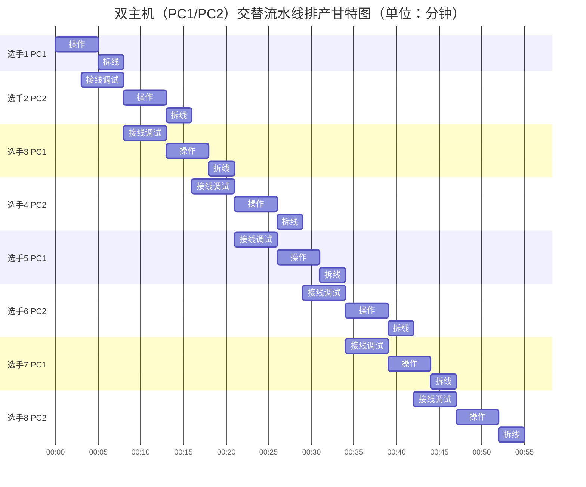

```mermaid
gantt
    title 双主机（PC1/PC2）交替流水线排产甘特图（单位：分钟）
    dateFormat HH:mm
    axisFormat %H:%M
    todayMarker off

    section 选手1 PC1
    操作          :s1a, 00:00, 5m
    拆线          :s1b, 00:05, 3m

    section 选手2 PC2
    接线调试      :s2a, 00:03, 5m
    操作          :s2b, 00:08, 5m
    拆线          :s2c, 00:13, 3m

    section 选手3 PC1
    接线调试      :s3a, 00:08, 5m
    操作          :s3b, 00:13, 5m
    拆线          :s3c, 00:18, 3m

    section 选手4 PC2
    接线调试      :s4a, 00:16, 5m
    操作          :s4b, 00:21, 5m
    拆线          :s4c, 00:26, 3m

    section 选手5 PC1
    接线调试      :s5a, 00:21, 5m
    操作          :s5b, 00:26, 5m
    拆线          :s5c, 00:31, 3m

    section 选手6 PC2
    接线调试      :s6a, 00:29, 5m
    操作          :s6b, 00:34, 5m
    拆线          :s6c, 00:39, 3m

    section 选手7 PC1
    接线调试      :s7a, 00:34, 5m
    操作          :s7b, 00:39, 5m
    拆线          :s7c, 00:44, 3m

    section 选手8 PC2
    接线调试      :s8a, 00:42, 5m
    操作          :s8b, 00:47, 5m
    拆线          :s8c, 00:52, 3m

```