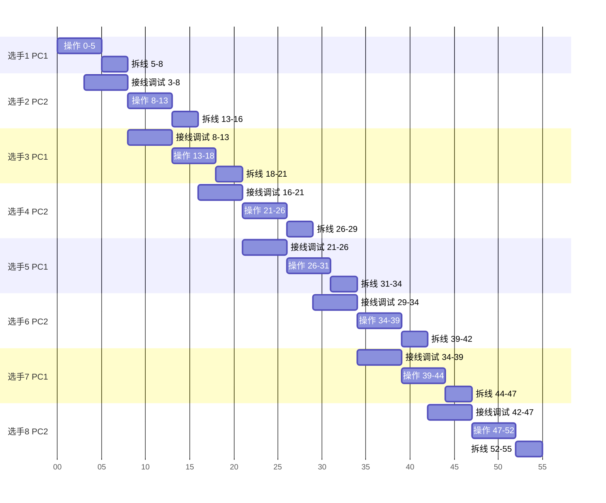

```mermaid
gantt
    dateFormat HH:mm
    axisFormat %M
    tickInterval 5m
    todayMarker off


    section 选手1 PC1
    操作 0-5          :s1a, 00:00, 5m
    拆线 5-8          :s1b, 00:05, 3m

    section 选手2 PC2
    接线调试 3-8      :s2a, 00:03, 5m
    操作 8-13         :s2b, 00:08, 5m
    拆线 13-16        :s2c, 00:13, 3m

    section 选手3 PC1
    接线调试 8-13     :s3a, 00:08, 5m
    操作 13-18        :s3b, 00:13, 5m
    拆线 18-21        :s3c, 00:18, 3m

    section 选手4 PC2
    接线调试 16-21    :s4a, 00:16, 5m
    操作 21-26        :s4b, 00:21, 5m
    拆线 26-29        :s4c, 00:26, 3m

    section 选手5 PC1
    接线调试 21-26    :s5a, 00:21, 5m
    操作 26-31        :s5b, 00:26, 5m
    拆线 31-34        :s5c, 00:31, 3m

    section 选手6 PC2
    接线调试 29-34    :s6a, 00:29, 5m
    操作 34-39        :s6b, 00:34, 5m
    拆线 39-42        :s6c, 00:39, 3m

    section 选手7 PC1
    接线调试 34-39    :s7a, 00:34, 5m
    操作 39-44        :s7b, 00:39, 5m
    拆线 44-47        :s7c, 00:44, 3m

    section 选手8 PC2
    接线调试 42-47    :s8a, 00:42, 5m
    操作 47-52        :s8b, 00:47, 5m
    拆线 52-55        :s8c, 00:52, 3m

```