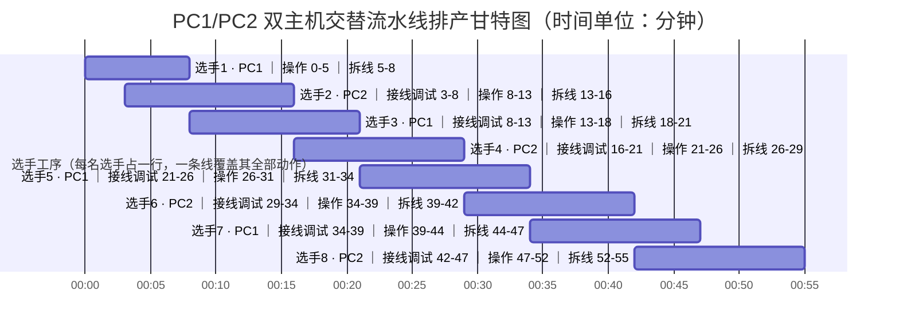

```mermaid
gantt
    title PC1/PC2 双主机交替流水线排产甘特图（时间单位：分钟）
    dateFormat HH:mm
    axisFormat %H:%M
    todayMarker off
    tickInterval 5min

    section 选手工序（每名选手占一行，一条线覆盖其全部动作）
    选手1 · PC1 ｜ 操作 0-5 ｜ 拆线 5-8                              :p1, 00:00, 8m
    选手2 · PC2 ｜ 接线调试 3-8 ｜ 操作 8-13 ｜ 拆线 13-16            :p2, 00:03, 13m
    选手3 · PC1 ｜ 接线调试 8-13 ｜ 操作 13-18 ｜ 拆线 18-21          :p3, 00:08, 13m
    选手4 · PC2 ｜ 接线调试 16-21 ｜ 操作 21-26 ｜ 拆线 26-29         :p4, 00:16, 13m
    选手5 · PC1 ｜ 接线调试 21-26 ｜ 操作 26-31 ｜ 拆线 31-34         :p5, 00:21, 13m
    选手6 · PC2 ｜ 接线调试 29-34 ｜ 操作 34-39 ｜ 拆线 39-42         :p6, 00:29, 13m
    选手7 · PC1 ｜ 接线调试 34-39 ｜ 操作 39-44 ｜ 拆线 44-47         :p7, 00:34, 13m
    选手8 · PC2 ｜ 接线调试 42-47 ｜ 操作 47-52 ｜ 拆线 52-55         :p8, 00:42, 13m

```